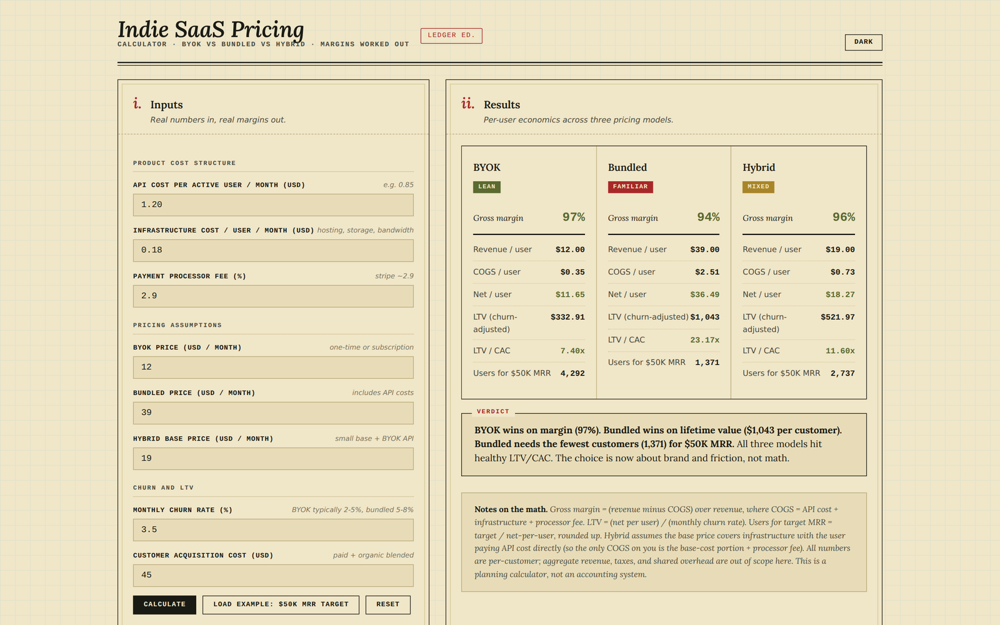

# indie-saas-pricing-calculator

**Live demo:** https://0xelitesystem.github.io/indie-saas-pricing-calculator/

Side-by-side pricing math for indie SaaS founders deciding between BYOK, bundled, and hybrid pricing. Real margins, real churn-adjusted LTV, real breakeven user counts. Browser-only.

For general information only. This is not financial, tax or legal advice. Check the numbers with a qualified professional before you rely on them.

## What it does

You're shipping a SaaS that uses an LLM or other paid API. You can charge customers in three ways:

- **BYOK** (bring your own key): customer pays the API provider directly, you charge a thin platform fee.
- **Bundled**: you charge a higher subscription that includes API costs; you eat the variance.
- **Hybrid**: small base subscription, customer pays API directly on top.

The tool calculates, per-model: gross margin, COGS per user, net per user, churn-adjusted LTV, LTV/CAC ratio, and the number of customers you need to hit $50K MRR.

## Inputs

| Input | What it's for |
|---|---|
| API cost / user / month | The variable cost of LLM or other API usage |
| Infrastructure cost / user / month | Hosting, bandwidth, storage |
| Payment processor fee (%) | Stripe default 2.9% + 30¢ ignored for simplicity |
| BYOK price | What you'd charge for the thin platform layer |
| Bundled price | All-in subscription that absorbs API |
| Hybrid base price | Lower base for users who bring their own key |
| Monthly churn rate (%) | Drives LTV math |
| CAC | Paid + organic blended |

## Outputs

Per pricing model:

- **Gross margin** (green ≥80%, amber 60-79%, red <60%)
- **Revenue / user / month**
- **COGS / user / month**
- **Net / user / month**
- **Churn-adjusted LTV** = net / churn rate
- **LTV/CAC ratio** (green ≥3x, amber 1.5-3x, red <1.5x)
- **Users needed for $50K MRR**

Plus a verdict block that names the winner per dimension and flags margins under 50% or LTV/CAC under 1.5x.

## Use it

[https://0xelitesystem.github.io/indie-saas-pricing-calculator/](https://0xelitesystem.github.io/indie-saas-pricing-calculator/)

Or open `index.html` locally; everything runs in the browser.

## What this tool does NOT do

- No taxes, no shared overhead (salary, tools, marketing), no cohort modeling. It's per-user math.
- No live API price data; you enter the rate.
- No live churn data; you enter your assumption.
- No connection to your billing provider; this is a planning calculator, not analytics.
- No storage. Reload the page and everything resets.

## What's not included

- No localStorage, no cookies, no tracking.
- No third-party scripts.
- No paywall.

## Pairs with

- [breakeven-runway-calculator](https://github.com/0xelitesystem/breakeven-runway-calculator): plug the net-per-user number from this tool into the runway calculator to project breakeven date.
- [indie-saas-financial-baseline](https://github.com/0xelitesystem/indie-saas-financial-baseline): the markdown reference on indie SaaS money discipline that this calculator implements one section of.
- [prompt-cost-calculator](https://github.com/0xelitesystem/prompt-cost-calculator): use this to figure out the per-user API cost input.

## More

Part of a catalog of single-file browser tools and plain-language references, all MIT licensed and dependency-free: [0xelitesystem.github.io](https://0xelitesystem.github.io/). Built by [elitesystem.ai](https://elitesystem.ai).

## License

MIT.
